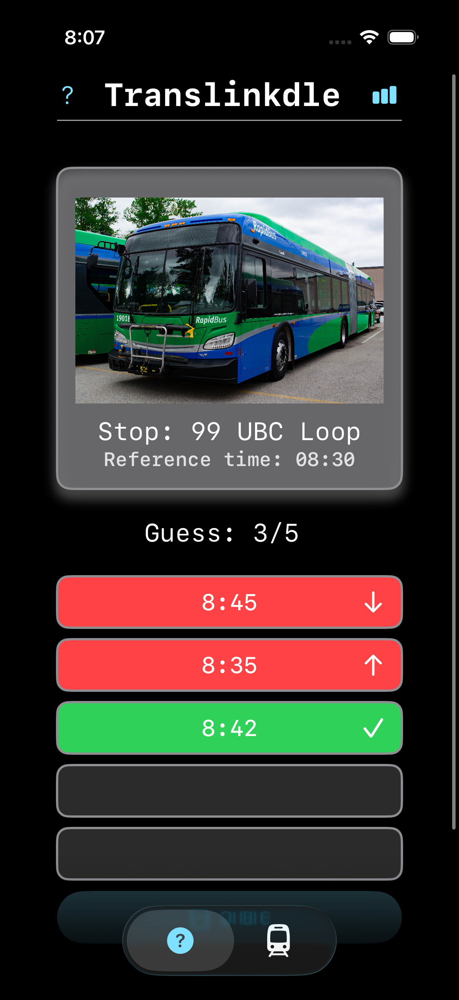
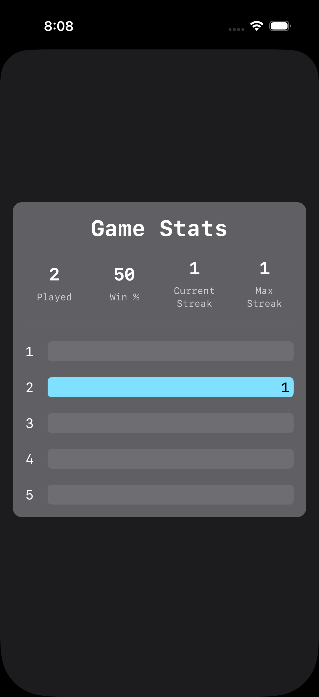

# Transit Daily Guessing Game

Transit Daily Guessing Game is an iOS app that challenges users to predict daily transit arrival times. Currently, it features a **daily guessing game** using static schedule data, with future plans for real-time stop tracking.

## Features

- **Daily Challenge**: A new transit guessing game appears each day.  
- **Score Feedback**: Points are awarded based on the accuracy of guesses.  
- **Local Schedule Storage**: SQLite database stores static daily transit schedules.  
- **Clean UI**: SwiftUI interface optimized for quick daily engagement.  
- **Future Real-Time Tracking**: Planned integration with transit APIs for live stop updates.  

## Tech & Skills

- **iOS Development**: Swift, SwiftUI, MVVM pattern  
- **Local Storage**: SQLite for structured schedule data  
- **Async Programming**: Prepared for API integration with Combine/async-await  
- **Version Control**: GitHub for project management and collaboration  

## Screenshots

  
  
